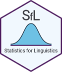

<style type="text/css">

img{
  border: none;
  margin: 5px;
}

</style>

```{r, include = FALSE}
knitr::opts_chunk$set(
  collapse = TRUE,
  comment = "#>"
)
```

```{r setup, include=F}
library(SfL)
library(DT)
library(lme4)
```

<div class="logo">

  

</div>

The `SfL` package was created to accompany the [Statistics for Linguistics](https://forensic-linguistics-sc.com/workshop/) online workshop in August/September 2021. The workshop was a satellite event to the [3rd Forensic Linguistics Short Course](https://forensic-linguistics-sc.com/).

This vignette gives an overview of data sets included in the `SfL` package. Please refer to the [functions vignette](https://htmlpreview.github.io/?https://github.com/dosc91/SfL/blob/main/vignettes/functions.html) for an overview of included functions.

---

# Overview

This is a full list of all data sets currently contained in `SfL`:

- [data_a](#data_a) - Age and Looks
- [data_c](#data_c) - Incomplete Neutralization
- [data_s](#data_s) - Duration of word-final /s/ in English
- [data_t](#data_t) - Tonal Alignment in German
- [data_v](#data_v) - Vowel Shortening in German

Variables contained within the individual data sets are described in their pertinent documentation.

---

# Age and Looks {#data_a}

The *Age and Looks* data set, `data_a`, contains data on age and appearance of fictional individuals.

A possible question to investigate with this data set is whether there is a dependency between different variables of the data set.

```{r include=T, eval=T}
# load data
data("data_a")

# number of rows and variables
dim(data_a) 
```

---

# Incomplete Neutralization {#data_c}

The *Incomplete Neutralization* data set, `data_c`, contains data on the phonological phenomenon of incomplete neutralization. The values are fictional, but closely related to real data, i.e. the data by Roettger et al. (2014).

A possible question to investigate with this data set is whether vowels are shorter when preceding voiceless word-final consonants.

```{r include=T, eval=T}
# load data
data("data_c")

# number of rows and variables
dim(data_c) 
```

---

# Duration of word-final /s/ in English {#data_s}

The *Duration of word-final /s/ in English* data set, `data_s`, contains data on three different types of word-final /s/ in English, i.e. non-morphemic, plural, and is-clitic /s/. The data is fictional, but closely related to the original data used in a study by Schmitz et al. (2020).

A possible question to investigate with this data set is whether the duration of /s/ depends on the type of /s/.

```{r include=T, eval=T}
# load data
data("data_s")

# number of rows and variables
dim(data_s) 
```

---

# Tonal Alignment in German {#data_t}

The *Tonal Alignment in German* data set, `data_t`, contains data on tonal alignment in German. The values are fictional, but closely related to real data, i.e. the data by Schmitz (2018).

A possible question to investigate with this data set is whether the frequency of low points differs by syllable structure.

```{r include=T, eval=T}
# load data
data("data_t")

# number of rows and variables
dim(data_t) 
```

---

# Tonal Alignment in German {#data_v}

The *Vowel Shortening in German* data set, `data_v`, contains data on the duration of vowels in open, simplex, and complex syllables in German. The data is fictional, but closely related to the original data used by Schmitz et al. (2018).

A possible question to investigate with this data set is whether vowel duration differs by syllable structure.

```{r include=T, eval=T}
# load data
data("data_v")

# number of rows and variables
dim(data_v) 
```

---

# References

Roettger, T. B., Winter, B., Kirby, J., Grawunder, S., & Grice, M. (2014). Assessing incomplete neutralization of final devoicing in German. Journal of Phonetics, 43: 11- 25.

Schmitz, D. (2018). Tonal Alignment and Segmental Composition in German. Master's Thesis. Universität zu Köln, Köln, Germany.

Schmitz, D. & Esser, J. (2021). SfL: Statistics for Linguistics. URL: https://github.com/dosc91/SfL

Schmitz, D., Baer-Henney, D., & Plag, I. (submitted). Revision invited by Phonetica.

Schmitz, D., Cho, H.-E., & Niemann, H. (2018). Vowel shortening in German as a function of syllable structure. Proceedings of 13. Phonetik und Phonologie Tagung. Humboldt University Berlin, Berlin, 28-29 September, 2017.

---

*Please message the author at contact@dominicschmitz.com in case of any questions, errors or ideas.*


